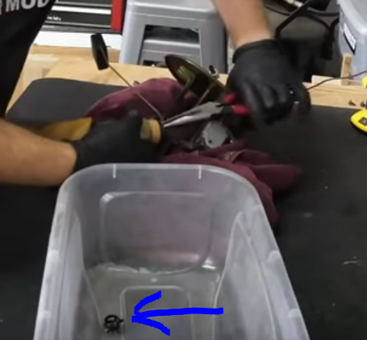

# Adjustable Fuel Press Regulator Install Guide
> Step by step from A+ Racing's [AFPR Tutorial 1](https://www.youtube.com/watch?v=EkF4vmxl9zk) and [AFPR Tutorial 2](https://www.youtube.com/watch?v=Vbc34_vtyms) and Brad's Car Mods [NA/NB Fuel Pump Replacment Guide](https://www.youtube.com/watch?v=bgorwchyJ0Q)

## Parts list
- [ ] [Advanced Autosports Fuel Pressure Regulator](https://www.advanced-autosports.com/collections/fuel-air-spark-system/products/99-05-pressure-regulator)

## Steps
1. [ ] Remove fuel pump relay, start car and remove gas from lines
2. [ ] Remove access panels
    - 
3. [ ] Remove fuel lines
    - 
4. [ ] Remove tank cover
    - 
5. [ ] Remove Fuel pump
    - 
6. [ ] Remove screw from assembly
    - 
7. [ ] Pull out the pump, may require some wiggling and rotation
    - 
8. [ ] Remove two clamps from fuel pump assembly
    - 
9. [ ] Remove wiring from pump assembly
    - 
10. [ ] Solder the new pump connect to the old wires
    - It is faint, but the black wire is ground and the blue-ish wire is positive
    - 
11. [ ] Heat shrink soldered wires
    - 
12. [ ] Attatch bracket to fuel pump with new rubber holder
    - 
13. [ ] Test fit fuel line with pump
    - 
14. [ ] Cut fuel line to fit
    - 
15. [ ] Add fuel line with clamps
    - 
16. [ ] Install fuel pump WITHOUT bracket, with fuel line WITHOUT screw
    - 
17. [ ] Add pre-filter
    - 
18. [ ] Install bracket and rubber
    - 
19. [ ] Install wires
    - 
    - 
20. [ ] Remove OEM fuel pressure regulator valve
    - 
21. [ ] Add new tube
    - 
22. [ ] Reinstall pump assembly in tank
    - 
23. [ ] Install wiring connector, leave rest unplugged
    - 
24. [ ] Plug feed line back in
    - 
25. [ ] Drill mounting holes for AFPR bracket
    - 
26. [ ] Cut hole in boot for trunk access
    - 
27. [ ] Fish fuel line through cut hole
    - May require removing the bracket in the way
    - 
28. [ ] Fish second fuel line
    - 
29. Install right angle line to tank with blue fitting
    - 
30. Install barbed fitting to straight line
    - 
31. Install barbed fitting straight line to remaining fuel line in car
    - 
32. Re-install tank cover
    - 
33. Install the right angle line in the trunk
    - 
34. Straight line trunk install
    - 