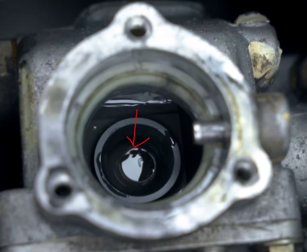
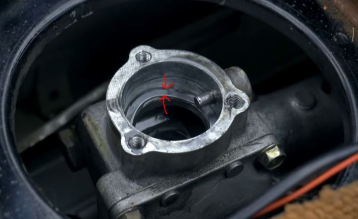

# Clutch Upgrade Guide
> Broken down, step-by-step from Donut's [Miata Shifter Upgrade Video](https://www.youtube.com/watch?v=Y3F3XP2iu4U)

## Parts list

## Removal
1. Remove shift knob
2. Remove center console
3. Remove shift boot
4. Remove heat insulation
5. Remove shifter (3 screws)

## Installation
1. Install tip bushing
    - 
2. Add transmission fluid to cover up tip busing
3. Install wave bushing
    - 