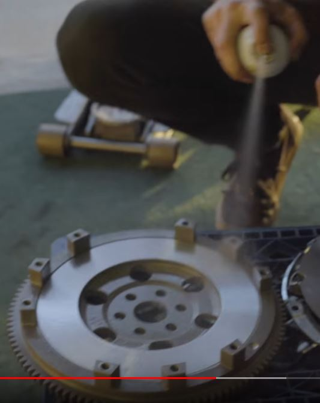

# Clutch Upgrade Guide
> Broken down, step-by-step from Donut's [Miata Clutch Upgrade Video](https://www.youtube.com/watch?v=Jnfkdm_wGAs)

## Parts list
- [ ] Clutch
- [ ] Transmission Fluid

## Removal
1. [ ] Exhaust
2. [ ] Front Wheels
3. [ ] Transmission Fluid
    - 
4. [ ] Driveshaft
    - 
5. [ ] Powerplant Frame (Not common in most cars)
    - 
6. [ ] Slave Cylinder
    - 
7. [ ] Transmission
    - Some wiring needs removed
8. [ ] Clutch
    - To help with removal reinstall a bell housing bolt
    - 
9. [ ] Flywheel
    - To help with removal reinstall a bell housing bolt
    - 
10. Rear main seal
    - Can be removed with picks or flathead screwdriver
    - Make sure not to scratch surface on either side of seal
    - 
11. Release bearing/throwout bearing
    - remove clutch fork
    - 
12. [ ] Clean transmission internals
    - [How to clean a transmission](https://www.youtube.com/watch?v=cxsCgmHJtQI)
    - NOTE: not trying to make spotless, just trying to remove bulk of grease and residue
    - place transmission in cement-mixing tub
    - With painter tape block off holes to shifter, rear main seal, etc
    - 
    - spray with citrus degreaser and let soak 10-15 minutes
    - 
    - scrub with wire brush
    - 
    - spray with foaming degreaser let soak 10-15 minutes
    - 
    - scrub with wire brush
    - 
    - liberally apply brake cleaner and allow to wash down
    - 

## Installation
> NOTE: apply threadlocker to bolts when reinstalling
1. [ ] Apply Grease to transmission aprts
    - Use high temp moly grease
    - Apply to clutch fork
        - 
    - reinstall clutch fork
        - 
    - Apply to splines (gear right after clutch bearing that engages transmission)
        - Use a very small amount of moly grease
            - 
2. [ ] Clean flywheel
    - comes from factory with oil to preven rusting, do not want when inside car
    - best cleaned with brake cleaner
    - wipe down after spraying
    - 
3. [ ] Clean pressure plate
    - comes from factory with oil to preven rusting, do not want when inside car
    - best cleaned with brake cleaner
    - wipe down after spraying
    - 
4. [ ] Install flywheel
    - make sure to use threadlocker when installing bolts
        - 
    - Must be torqued to proper spec
    - 
    - After installation apply break cleaner and wipe down
    - 
5. [ ] Mount clutch and pressure plate
    - Install clutch
        - 
    - Install pressure plate
        - 
    - should slide on to flywheel
    - Use clutch alignment tool
        - For validating clutch disk is centered
        - 
    - install and tighten all bolts
        - 
6. [ ] Install transmission
    - 
    - 
7. [ ] Put in shifter
    - quick and dirty - not full reinstall
    - Put car in gear to mount driveshaft
    - 
8. [ ] install driveshaft
    - use shifter to spin splines between clutch and transmission to mate
    - 
9. [ ] Mount powerplant frame
    - 
10. [ ] Install bell housing bolts to transmission
    - 
11. [ ] Install exhaust
12. [ ] Install wires to clutch
13. [ ] Install shifter for good
    - Add fluid (Turkey baster recommended) MTL Gear oil to shfiter turret  (approx 1 qt)
    - 
14. [ ] Add MTL gear oil fluid to transmission
    - Pump into fill plug until it starts to leak out (approx 2 qts)
    - 
15. [ ] Bleed cutch slave cylinder
    - use baster to remove old clutch fluid, get what you can
        - 
    - fill with clutch fluid
        - 
    - open bleeder, attach bottle to capture and allow gravity to remove some fluid
        - 
    - close bleeder
    - pump the clutch
    - hold down clutch, open bleeder
    - repeat pump, hold, bleed approximately 3-5 times
    - 

## Validation
NOTE: do so while car still on jacks
1. start car in neutral
2. make sure wheels do not spin when clutch not engages
3. put car into first gear, make sure wheel is spinning
4. listen for weird noises, shudders, vibrations, and shakes

## Final steps
1. [ ] Install front wheels
2. [ ] make sure all fluid is topped off