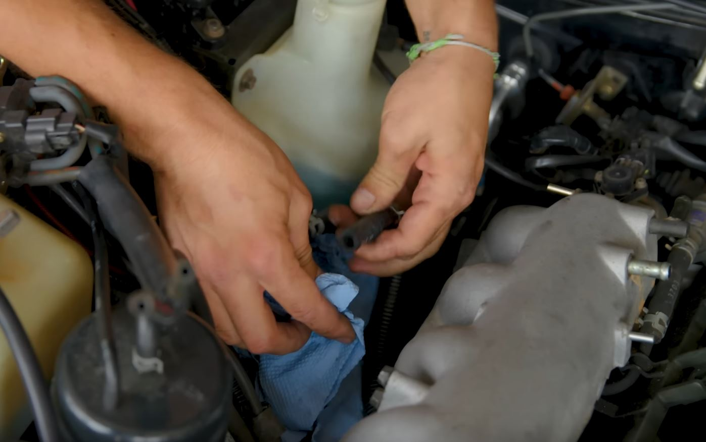
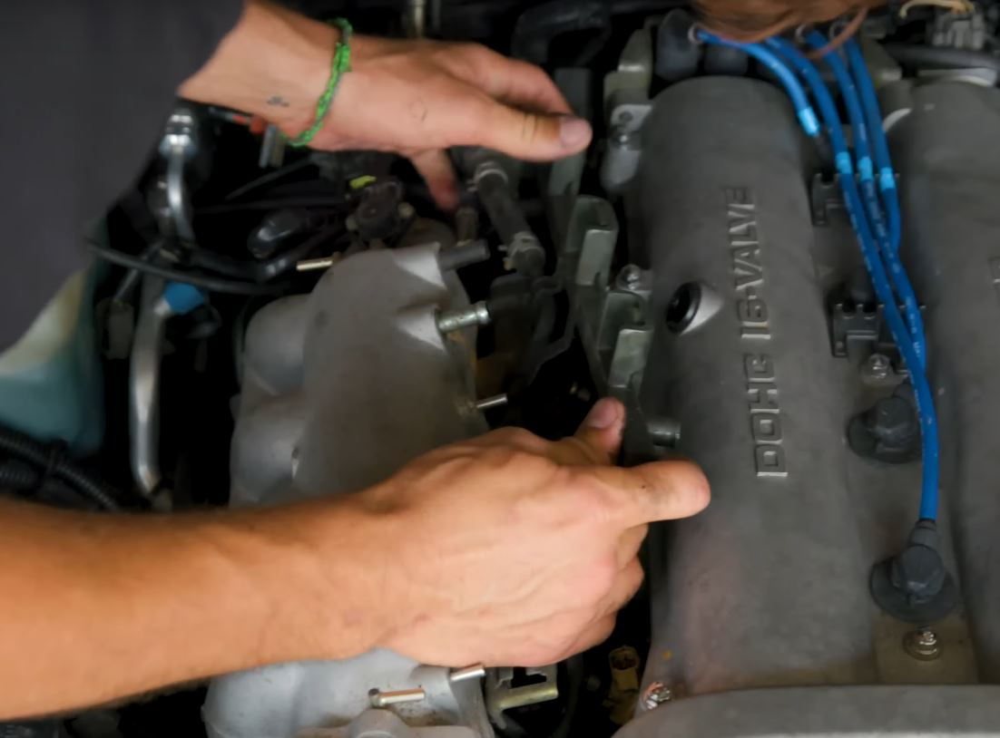
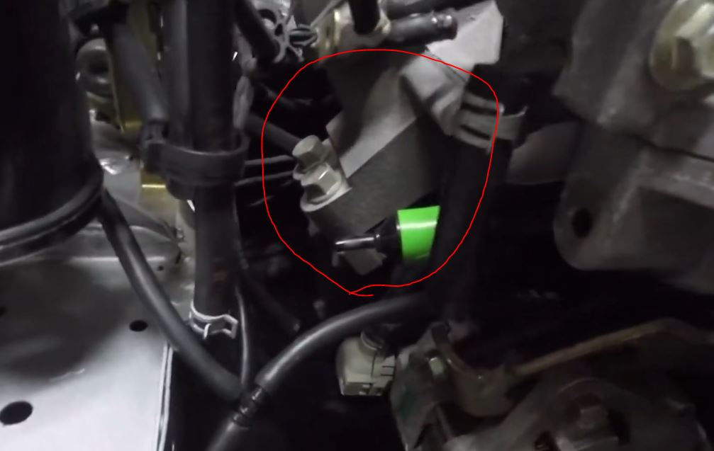
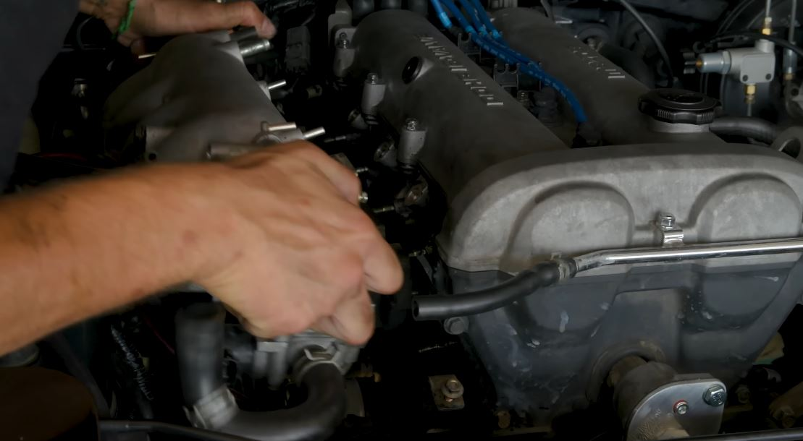
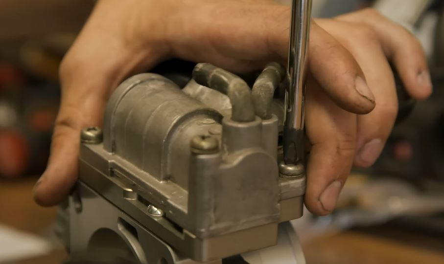
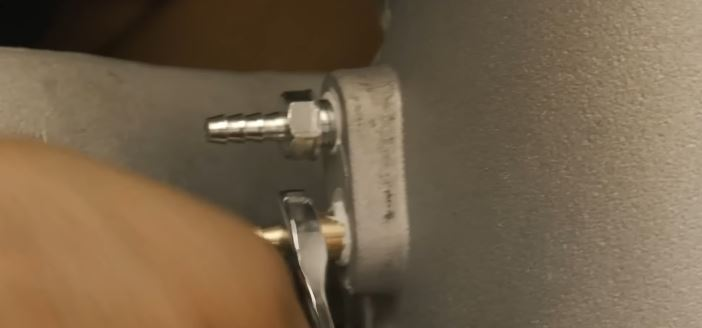

# Intake manifold Upgrade Guide
> Broken down, step-by-step from Donut's [Miata Intake Manifold Video](https://www.youtube.com/watch?v=3X1Zdpkj0-s)

## notes
[This guide](https://youtu.be/cGhr5t23b4Q?si=-IvFZkNB0aUr52kS&t=112) was able to remove the upper throttle body without removing the fuel rail

## removal
1. [ ] hoses
2. [ ] vaccuum lines
3. [ ] fuel lines
    - 
4. [ ] fuel injectors
5. [ ] fuel rail
    - once bolts are removed just kind of wiggles out
    - 
6. [ ] intake manifold bracked
    - 
7. [ ] intake manifold removal
    - 

## install 
1. [ ] install parts from old throttle body to new throttle body
    - 
2. [ ] vacuum fittings installation
    - 
3. [ ] Gasket install
4. [ ] intake manifold install
5. [ ] coolant lines to throttle body
6. [ ] fuel system install